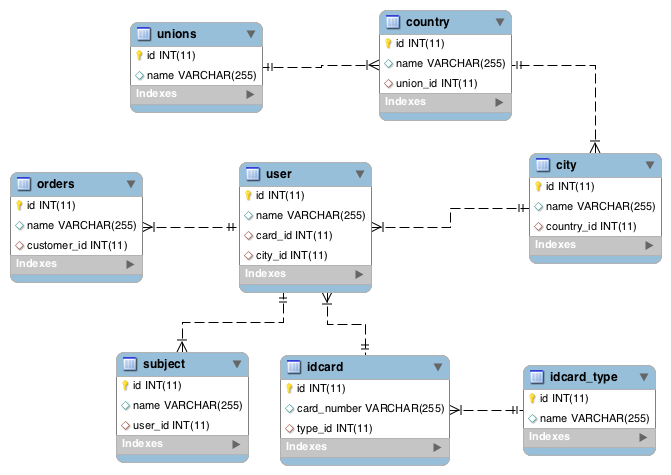

# Spring JPA fetch test
I used Spring, Hibernate & Spring boot few times back then at University, I'v started using it again recently.

In this project, I want to check how Spring JPA load an entity and its relationships. How it deals with `@xToOne` and `xToMany` relationships.

## Data models:


`Order` have many relationships, some is `@ManyToOne`, 1 is `@OneToMany`.

## Test with findById()
Here is the query when we execute findById(orderId)
```sql
Hibernate: 
    select
        order0_.id as id1_4_0_,
        order0_.customer_id as customer3_4_0_,
        order0_.name as name2_4_0_,
        user1_.id as id1_7_1_,
        user1_.card_id as card_id3_7_1_,
        user1_.city_id as city_id4_7_1_,
        user1_.name as name2_7_1_,
        idcard2_.id as id1_2_2_,
        idcard2_.card_number as card_num2_2_2_,
        idcard2_.type_id as type_id3_2_2_,
        city3_.id as id1_0_3_,
        city3_.country_id as country_3_0_3_,
        city3_.name as name2_0_3_ 
    from
        orders order0_ 
    left outer join
        user user1_ 
            on order0_.customer_id=user1_.id 
    left outer join
        idcard idcard2_ 
            on user1_.card_id=idcard2_.id 
    left outer join
        city city3_ 
            on user1_.city_id=city3_.id 
    where
        order0_.id=?
Hibernate: 
    select
        idcardtype0_.id as id1_3_0_,
        idcardtype0_.name as name2_3_0_ 
    from
        idcard_type idcardtype0_ 
    where
        idcardtype0_.id=?
Hibernate: 
    select
        country0_.id as id1_1_0_,
        country0_.name as name2_1_0_,
        country0_.union_id as union_id3_1_0_,
        union1_.id as id1_6_1_,
        union1_.name as name2_6_1_ 
    from
        country country0_ 
    left outer join
        unions union1_ 
            on country0_.union_id=union1_.id 
    where
        country0_.id=?
```

Spring boot load all the `@ManyToOne` relationships using 1 join query.
But it can not load all the thing at 1 query, the relationship `order.customer.city` have it owns relationship is `Country`, 1 extra query is executed for `Country`, and another one for `IDCardType`.

## Test with findAll()
Here is the query when we execute findAll():
```sql
Hibernate: 
    select
        order0_.id as id1_4_,
        order0_.customer_id as customer3_4_,
        order0_.name as name2_4_ 
    from
        orders order0_
Hibernate: 
    select
        user0_.id as id1_7_0_,
        user0_.card_id as card_id3_7_0_,
        user0_.city_id as city_id4_7_0_,
        user0_.name as name2_7_0_,
        idcard1_.id as id1_2_1_,
        idcard1_.card_number as card_num2_2_1_,
        idcard1_.type_id as type_id3_2_1_,
        idcardtype2_.id as id1_3_2_,
        idcardtype2_.name as name2_3_2_,
        city3_.id as id1_0_3_,
        city3_.country_id as country_3_0_3_,
        city3_.name as name2_0_3_,
        country4_.id as id1_1_4_,
        country4_.name as name2_1_4_,
        country4_.union_id as union_id3_1_4_ 
    from
        user user0_ 
    left outer join
        idcard idcard1_ 
            on user0_.card_id=idcard1_.id 
    left outer join
        idcard_type idcardtype2_ 
            on idcard1_.type_id=idcardtype2_.id 
    left outer join
        city city3_ 
            on user0_.city_id=city3_.id 
    left outer join
        country country4_ 
            on city3_.country_id=country4_.id 
    where
        user0_.id=?
Hibernate: 
    select
        union0_.id as id1_6_0_,
        union0_.name as name2_6_0_ 
    from
        unions union0_ 
    where
        union0_.id=?
```
We have 1 query for all orders, and 1 extra query for each relationship of order.
Even if we change the fetch mode to JOIN `@Fetch(FetchMode.JOIN)`, Spring JPA still behaves the same way.

## Test with custom functions:
I tested with some custom functions belove, the result is the same with `findAll` and `findById`.
```java
    @Query("SELECT o FROM orders o WHERE o.id IN ?1")
    List<Order> findByIds(List<Integer> ids);
    
    @Query("SELECT o FROM orders o WHERE o.name = ?1")
    Order findByName(String name);
```

## So:
- Spring JPA does not work as my assumtion, I thought default fetch type is always LAZY. But Default fetch type of `@ManyToOne` and `@OneToOne` relationships is EAGERly, while default of `@OneToMany` and `@ManyToMany` is LAZYly.
- findById() will load all the EAGER relationship by using join, some extra queries can be executed for complex relationships.
- findAll() will load all the EAGER relationship by using a separate query,no matter the fetch mode is defined or not (which is not good). This is a kind of N+1 problem I think.
- With complex model with hundred of entities, Spring JPA may be load many entities with just a simple function like `findById()`

### Question:
What is the best practice here? For small application, this is not a big deal, but for medium or big application, this will increase the database load a lot.

Should we defind all fetch type is LAZY? and manually defind the query only load the information that we need?